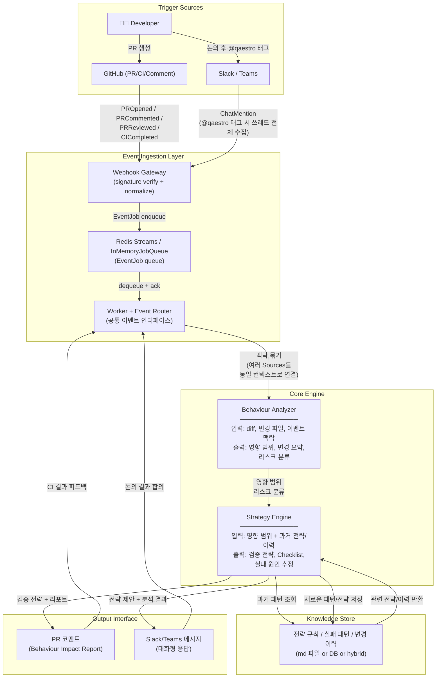

# Architecture

컴포넌트 간 Integration 구조 설계. (ref: [#1](https://github.com/Kimcheolhui/qaestro/issues/1), [#3](https://github.com/Kimcheolhui/qaestro/issues/3))

물리적 레포 구조는 [PROJECT_STRUCTURE.md](./PROJECT_STRUCTURE.md) 참고.

## Event Flow



## 컴포넌트 상세

### 1. Event Ingestion Layer

GitHub App, Slack/Teams는 서로 다른 trigger source. 이들을 공통 이벤트 인터페이스로 통합.

**이벤트 타입:**

```
PROpened    { meta: EventMeta, repo, pr_number, title, author, base_branch, head_branch,
              diff_url, files_changed: [FileChange], ... }
PRUpdated   { meta: EventMeta, repo, pr_number, ... }          # PROpened와 같은 필드 (synchronize/edited/reopened)
PRCommented { meta: EventMeta, repo, pr_number, author, body, comment_id, ... }
PRReviewed  { meta: EventMeta, repo, pr_number, reviewer, state, body, ... }   # state: approved/changes_requested/commented
CICompleted { meta: EventMeta, repo, pr_number, commit_sha, conclusion, failed_jobs, ... }
ChatMention { meta: EventMeta, platform, channel_id, channel_name, author, message, ... }
```

모든 이벤트는 공통 `EventMeta`(`event_id`, `event_type`, `correlation_id`, `timestamp`, `source`)를 포함한다. 실제 계약의 repo 필드명은 `repo_full_name`이며, 위 표기는 개요 용도의 shorthand.

`FileChange`는 경량 메타데이터(`path`, `status`, `additions`, `deletions`, `previous_filename`)만 보유. 실제 diff 텍스트와 파일 내용은 이벤트에 싣지 않고, runtime에서 별도 fetch 레이어(`GET /repos/{owner}/{repo}/pulls/{number}/files` 등)로 조회한다. 이벤트가 작을수록 queue·persist·replay 비용이 낮아지기 때문.

`ChatMention`은 개발자가 `@qaestro`를 태그했을 때 발생. 쓰레드 전체를 읽고 변경 의도/맥락을 파악하며, 태그 시 요약 메시지가 함께 있으면 보조 맥락으로 활용한다.

Agent가 채널을 상시 모니터링하지 않음. 개발자가 필요할 때 호출하는 방식.

**설계 고려 사항:**

- 하나의 PR에 대해 여러 소스에서 이벤트가 들어올 때 (채널 논의 + PR 생성 + CI 결과) **같은 맥락으로 묶는 방법**
- 이벤트 간 **순서와 타이밍** — 채널 논의가 PR보다 먼저 올 수도, 나중에 올 수도 있음

### Queue boundary

`InMemoryJobQueue`는 테스트와 단일 프로세스 local wiring용이다. gateway와 worker를 별도 프로세스로 실행하면 각 프로세스의 메모리가 분리되므로 같은 queue를 공유하지 못한다. self-hosted MVP에서 실제 프로세스 분리를 검증할 때는 Redis Streams backend를 사용한다. Redis Streams는 `EventJob` payload를 durable하게 보관하고, worker consumer group이 처리 후 ack하는 경계로 동작한다.

Redis backend 실행에 필요한 핵심 환경변수는 `QAESTRO_QUEUE_BACKEND=redis-streams`, `QAESTRO_REDIS_URL`, `QAESTRO_REDIS_STREAM`, `QAESTRO_REDIS_CONSUMER_GROUP`이다. gateway와 worker는 같은 URL/stream/group을 봐야 하고, worker process는 long-lived consumer로 실행된다. `QAESTRO_REDIS_CONSUMER`를 지정하지 않으면 worker가 `hostname-pid` 형태의 process-unique consumer name을 사용해 multi-worker 관측성을 유지한다. Redis worker는 처리 완료 후 실제 PR comment를 게시해야 하므로 `QAESTRO_GITHUB_APP_ID`, `QAESTRO_GITHUB_APP_INSTALLATION_ID`, `QAESTRO_GITHUB_APP_PRIVATE_KEY_PATH`도 함께 설정되어야 한다.

worker는 처리 중 ack되지 않은 message를 장애 복구 대상으로 `XAUTOCLAIM`할 수 있다. 기본 `QAESTRO_REDIS_CLAIM_IDLE_MS`는 300000ms(5분)로 둔다. 이 값이 실제 job 처리 시간보다 너무 작으면 정상 처리 중인 long-running job이 다른 worker에게 중복 claim될 수 있으므로, 운영에서는 worker timeout·LLM 호출 시간·GitHub posting 시간을 합친 최대 처리 시간보다 크게 설정해야 한다. retry가 모두 실패하거나 malformed payload를 만난 terminal failure는 stream을 막지 않도록 ack하되, worker가 `correlation_id`, `delivery_id`, `attempts`, `error`를 포함한 error log를 남긴다. DLQ와 metrics는 운영 안정화 단계에서 확장한다.

### Tool runtime boundary

qaestro는 정해진 workflow를 따르되, 각 단계 안에서는 agent 또는 deterministic runner가 필요한 tool을 선택적으로 사용할 수 있게 한다. 이때 tool 사용 범위는 단계별 policy로 제한한다. 외부 webhook input event 자체는 tool call이 아니다. GitHub/ChatOps gateway는 raw provider payload를 검증하고 `PROpened`, `PRUpdated`, `CICompleted`, `ChatMention` 같은 normalized event로 바꾼 뒤 queue에 넣는 ingestion boundary로 남는다.

```text
normalized event
→ workflow stage
→ stage-approved ToolRuntime call
→ provider adapter backend
→ normalized context / output result
```

| 단계 | 허용되는 tool 성격 | Step 3.5 기준 예시 |
|------|-------------------|--------------------|
| Context acquisition | PR metadata/diff/files, PR comments/reviews, 관련 chat thread, knowledge read | `github.pr.view`, `github.pr.files`, `github.pr.diff` |
| Analysis / strategy | 수집된 context, knowledge read, 제한된 추가 조회 | `knowledge.search` |
| Validation | strategy가 선택한 runtime probe/test execution | 이후 Step 5에서 runtime probe tool 추가 |
| Output | PR comment, review comment, chat response 같은 write action | `github.pr.comment.create_or_update` |

Read tool은 맥락 수집과 판단을 돕기 위해 비교적 넓게 허용할 수 있지만, write tool은 output policy를 거쳐야 한다. destructive action은 기본 금지이며, comment 작성·knowledge write 같은 side effect는 correlation id와 중복 방지 정책을 함께 고려한다.

Step 3.5에서는 GitHub backend를 기존 GitHub Client API adapter로 유지하고, raw shell/CLI를 열지 않는다. 목표는 transport 교체가 아니라 `Worker`/workflow가 GitHub-specific provider나 poster를 직접 잡지 않도록 read/write 실행 경계를 `ToolRuntime` 뒤로 옮기는 것이다. Agent Framework runner가 들어오기 전까지 tool 선택은 deterministic sequence로 시작하되, 같은 tool contract와 stage policy 위에서 나중에 agent 선택으로 교체할 수 있어야 한다.

### 2. Behaviour Analyzer

"이 PR에서 무엇이 변했는가" — 사실 기반 분석.

|          | 내용                                                     |
| -------- | -------------------------------------------------------- |
| **입력** | diff, 변경 파일 목록, 이벤트 맥락 (채널 논의 포함)       |
| **출력** | 영향 범위, 변경 요약, 리스크 분류 (High / Medium / Low)  |
| **책임** | 사실 기반 분석만 수행. "무엇을 검증할지"는 판단하지 않음 |

### 3. Strategy Engine

"그래서 무엇을 검증해야 하는가" — 판단 + 전략 적용.

|          | 내용                                                              |
| -------- | ----------------------------------------------------------------- |
| **입력** | Behaviour Analyzer의 영향 범위 + Knowledge Store의 과거 전략/이력 |
| **출력** | 검증 전략, Behaviour Checklist, 실패 원인 추정, 누락 테스트 제안  |
| **책임** | Knowledge Store를 조회하여 과거 패턴을 반영한 판단 수행           |

Behaviour Analyzer ↔ Strategy Engine 경계가 모호하면 하나의 monolithic LLM call이 됨. 분석(사실)과 판단(전략)을 명확히 분리할 것.

### 4. Knowledge Store

Agent의 QA 전략이 점진적으로 정밀해지기 위한 지식 저장소.

**저장 대상:**

- 실패 패턴 — e.g. "결제 영역 변경 시 0원 경계값 이슈 발생 이력"
- QA 전략 규칙 — e.g. "할인 순서 변경 시 복합 할인 경계값 검증 필수"
- 영역별 변경/실패 이력

**읽기 시점:**

- PR 분석 시 — Strategy Engine이 과거 패턴 조회하여 검증 전략에 반영
- 채널 논의 시 — 과거 이력 기반으로 영향 범위 분석 및 전략 제안 (e.g. "최근 3주간 이 영역 변경 2건, 관련 테스트 실패 이력 1건")

**쓰기 시점:**

- CI 결과 피드백 후 (Layer 2)
- 채널 논의에서 합의된 전략 (Layer 3)

**저장 형태 후보:**
| 형태 | 장점 | 단점 |
|------|------|------|
| md 파일 (repo 내) | 버전 관리 가능, 개발자가 직접 읽기/수정 가능, 별도 인프라 불필요 | 검색 성능 한계 |
| embedding 기반 retrieval | 패턴 매칭에 유리 | 인프라 필요 |
| structured rules (DB) | 정형 데이터 쿼리에 유리 | 개발자 접근성 낮음 |
| 하이브리드 | md 파일이 source of truth, 검색 성능이 필요한 부분만 인덱싱 | 구현 복잡도 |

### 5. Output Interface

같은 판단 결과라도 채널에 따라 포맷과 상세 수준이 달라야 함. 공통 판단 결과 → 채널별 렌더러 구조.

| 채널        | 포맷            | 예시                                                                            |
| ----------- | --------------- | ------------------------------------------------------------------------------- |
| PR 코멘트   | 구조화된 리포트 | Behaviour Impact Report (High/Medium Risk 분류, Checklist)                      |
| Slack/Teams | 대화형 자연어   | "결제 플로우에 영향이 예상됩니다. 영향 범위: checkout API, order-summary UI..." |
