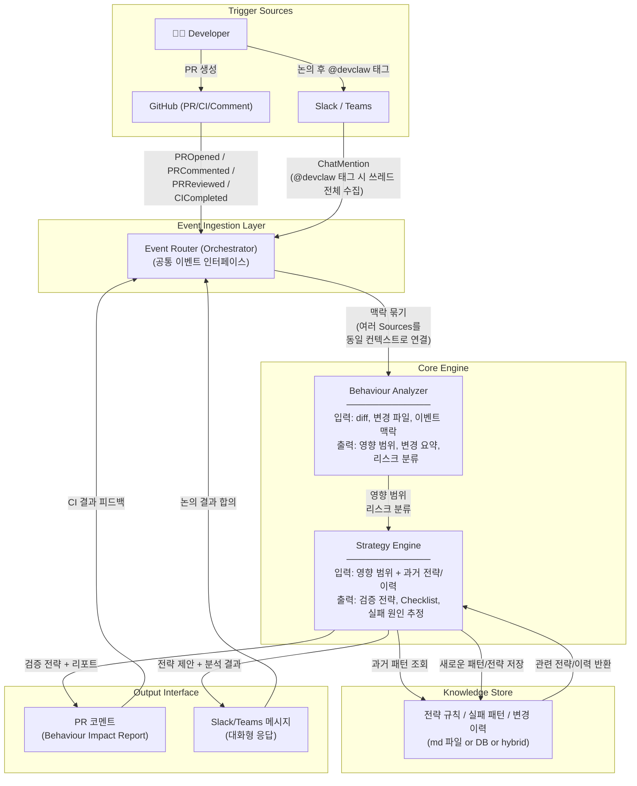

# Architecture

컴포넌트 간 Integration 구조 설계. (ref: [#1](https://github.com/Kimcheolhui/devclaw/issues/1), [#3](https://github.com/Kimcheolhui/devclaw/issues/3))

물리적 레포 구조는 [PROJECT_STRUCTURE.md](./PROJECT_STRUCTURE.md) 참고.

## Event Flow



## 컴포넌트 상세

### 1. Event Ingestion Layer

GitHub App, Slack/Teams는 서로 다른 trigger source. 이들을 공통 이벤트 인터페이스로 통합.

**이벤트 타입:**

```
PROpened { repo, diff, author, ... }
PRCommented { repo, pr, author, body, ... }
PRReviewed { repo, pr, reviewer, verdict, comments, ... }
CICompleted { repo, pr, results, ... }
ChatMention { channel, thread, mentionType, ... }
```

`ChatMention`은 개발자가 `@devclaw`를 태그했을 때 발생. 쓰레드 전체를 읽고 변경 의도/맥락을 파악하며, 태그 시 요약 메시지가 함께 있으면 보조 맥락으로 활용한다.

Agent가 채널을 상시 모니터링하지 않음. 개발자가 필요할 때 호출하는 방식.

**설계 고려 사항:**

- 하나의 PR에 대해 여러 소스에서 이벤트가 들어올 때 (채널 논의 + PR 생성 + CI 결과) **같은 맥락으로 묶는 방법**
- 이벤트 간 **순서와 타이밍** — 채널 논의가 PR보다 먼저 올 수도, 나중에 올 수도 있음

### 2. Behaviour Analyzer

"이 PR에서 무엇이 변했는가" — 사실 기반 분석.

|          | 내용                                                     |
| -------- | -------------------------------------------------------- |
| **입력** | diff, 변경 파일 목록, 이벤트 맥락 (채널 논의 포함)       |
| **출력** | 영향 범위, 변경 요약, 리스크 분류 (High / Medium / Low)  |
| **책임** | 사실 기반 분석만 수행. "무엇을 검증할지"는 판단하지 않음 |

### 3. Strategy Engine

"그래서 무엇을 검증해야 하는가" — 판단 + 전략 적용.

|          | 내용                                                              |
| -------- | ----------------------------------------------------------------- |
| **입력** | Behaviour Analyzer의 영향 범위 + Knowledge Store의 과거 전략/이력 |
| **출력** | 검증 전략, Behaviour Checklist, 실패 원인 추정, 누락 테스트 제안  |
| **책임** | Knowledge Store를 조회하여 과거 패턴을 반영한 판단 수행           |

Behaviour Analyzer ↔ Strategy Engine 경계가 모호하면 하나의 monolithic LLM call이 됨. 분석(사실)과 판단(전략)을 명확히 분리할 것.

### 4. Knowledge Store

Agent의 QA 전략이 점진적으로 정밀해지기 위한 지식 저장소.

**저장 대상:**

- 실패 패턴 — e.g. "결제 영역 변경 시 0원 경계값 이슈 발생 이력"
- QA 전략 규칙 — e.g. "할인 순서 변경 시 복합 할인 경계값 검증 필수"
- 영역별 변경/실패 이력

**읽기 시점:**

- PR 분석 시 — Strategy Engine이 과거 패턴 조회하여 검증 전략에 반영
- 채널 논의 시 — 과거 이력 기반으로 영향 범위 분석 및 전략 제안 (e.g. "최근 3주간 이 영역 변경 2건, 관련 테스트 실패 이력 1건")

**쓰기 시점:**

- CI 결과 피드백 후 (Layer 2)
- 채널 논의에서 합의된 전략 (Layer 3)

**저장 형태 후보:**
| 형태 | 장점 | 단점 |
|------|------|------|
| md 파일 (repo 내) | 버전 관리 가능, 개발자가 직접 읽기/수정 가능, 별도 인프라 불필요 | 검색 성능 한계 |
| embedding 기반 retrieval | 패턴 매칭에 유리 | 인프라 필요 |
| structured rules (DB) | 정형 데이터 쿼리에 유리 | 개발자 접근성 낮음 |
| 하이브리드 | md 파일이 source of truth, 검색 성능이 필요한 부분만 인덱싱 | 구현 복잡도 |

### 5. Output Interface

같은 판단 결과라도 채널에 따라 포맷과 상세 수준이 달라야 함. 공통 판단 결과 → 채널별 렌더러 구조.

| 채널        | 포맷            | 예시                                                                            |
| ----------- | --------------- | ------------------------------------------------------------------------------- |
| PR 코멘트   | 구조화된 리포트 | Behaviour Impact Report (High/Medium Risk 분류, Checklist)                      |
| Slack/Teams | 대화형 자연어   | "결제 플로우에 영향이 예상됩니다. 영향 범위: checkout API, order-summary UI..." |
